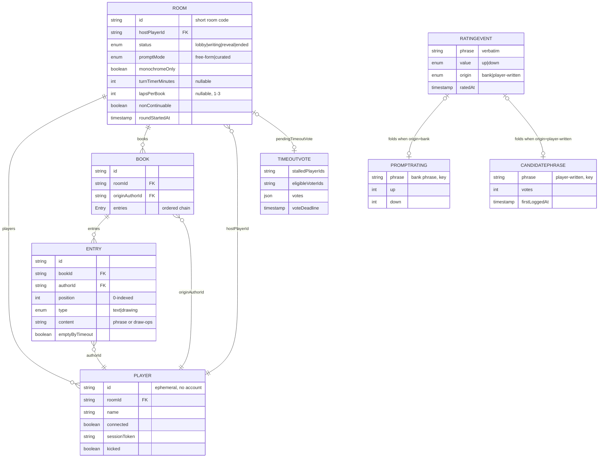

<!-- ardd-badge-version-start -->
[![built with ArDD](https://shieldcn.dev/badge/dynamic/json.svg?url=https://raw.githubusercontent.com/moui72/exquisite-telephone/main/.github/badges/ardd-version.json&query=%24.message&label=built%20with%20ArDD&color=yellow&labelColor=%232F4858&variant=secondary&logo=data:image/svg+xml;base64,PHN2ZyB4bWxucz0iaHR0cDovL3d3dy53My5vcmcvMjAwMC9zdmciIHZpZXdCb3g9IjAgMCAxMDAgMTAwIiByb2xlPSJpbWciIGFyaWEtbGFiZWw9IkFyREQiPgo8IS0tIFNvdXJjZSBvZiB0cnV0aCBmb3IgdGhlIEFyREQgYmFkZ2UgbWFyazogdGhlIGJhZGdlIHdvcmtmbG93IGlubGluZXMgdGhpcyBmaWxlIHZlcmJhdGltIGFzIHRoZSBlbmRwb2ludCBKU09OJ3MgbG9nb1N2Zy4gRGFyay1iYWNrZ3JvdW5kIHZhcmlhbnQgKGJhZGdlIGxhYmVsIHNpZGUpOiB3aGl0ZSByaW5nL3JlY3Q7IHRoZSBmb3VydGggdHJpYW5nbGUgaXMgd2hpdGUsIG1hdGNoaW5nIHRoZSBsb2dvJ3MgZGFyay1jb250ZXh0IHRyZWF0bWVudC4gLS0%2BCjxjaXJjbGUgY3g9IjUwIiBjeT0iNTAiIHI9IjM0IiBmaWxsPSJub25lIiBzdHJva2U9IiNmZmZmZmYiIHN0cm9rZS13aWR0aD0iNiIvPgo8cmVjdCB4PSI0MSIgeT0iMzkiIHdpZHRoPSIxOCIgaGVpZ2h0PSIyMiIgcng9IjMiIGZpbGw9IiNmZmZmZmYiLz4KPHBvbHlnb24gcG9pbnRzPSIxMCwwIC04LC05IC04LDkiIGZpbGw9IiNmMjY0MTkiIHRyYW5zZm9ybT0idHJhbnNsYXRlKDQxIDE3KSByb3RhdGUoLTE1KSIvPgo8cG9seWdvbiBwb2ludHM9IjEwLDAgLTgsLTkgLTgsOSIgZmlsbD0iI2Y2YWUyZCIgdHJhbnNmb3JtPSJ0cmFuc2xhdGUoMTcgNDEpIHJvdGF0ZSgtNzUpIi8%2BCjxwb2x5Z29uIHBvaW50cz0iMTAsMCAtOCwtOSAtOCw5IiBmaWxsPSIjODZiYmQ4IiB0cmFuc2Zvcm09InRyYW5zbGF0ZSg4MyA1OSkgcm90YXRlKDEwNSkiLz4KPHBvbHlnb24gcG9pbnRzPSIxMCwwIC04LC05IC04LDkiIGZpbGw9IiNmZmZmZmYiIHRyYW5zZm9ybT0idHJhbnNsYXRlKDU5IDgzKSByb3RhdGUoMTY1KSIvPgo8L3N2Zz4K)](https://github.com/moui72/artifact-driven-dev)
<!-- ardd-badge-version-end -->
[](https://github.com/sponsors/moui72)

## Datamodel



## Infrastructure

```mermaid
graph TD
    subgraph client[Browser - Svelte SPA]
        UI[Client app]
        PNG[PNG export - client-side rasterize]
    end

    subgraph proc[Single Node process - one port]
        SIO[Socket.IO realtime layer]
        STATIC[Serves built client dist/]
        STATE[In-memory game state - Rooms/Books/Entries]
        SESS[Session store - token to player, short TTL]
        SWEEP[Turn timer sweep - 30s setInterval]
        CUR[Curation store - append-only JSON events]
    end

    VOL[(Fly volume - curation.json)]
    FLY[Fly.io - beta from main, prod from release]

    UI -->|"socket events (join, submit entry)"| SIO
    STATIC -->|serves build| UI
    SIO --> STATE
    SIO --> SESS
    SWEEP -->|advances stalled rounds| STATE
    SIO -->|"rating rides onSubmitEntry"| CUR
    CUR -->|one file per event| VOL
    UI --> PNG
    proc -->|deployed as one app| FLY

## UI

```mermaid
graph TD
    App[App.svelte - routes by Room.status]
    App --> SalonFooter[SalonFooter - always present]
    App --> Lobby[Lobby View]
    App --> WD[Writing / Drawing View]
    App --> Reveal[Reveal View]
    App --> States[Terminal states - ended / kicked / error]

    SalonFooter -->|host gavel opens| ModPanel[ModerationPanel]
    SalonFooter -->|? opens| Rules[RulesOverview panel]

    Lobby --> InfoTip[InfoTooltip - per host setting]
    Lobby -->|derives from activePlayers| Rules

    WD --> Canvas[DrawingCanvas - draw ops]
    WD --> TurnStatus[TurnStatus - whose turn]
    WD --> InfoTip

    Reveal --> Gilt[GiltFrame - book viewer]
    Lobby --> Gilt
    WD --> Gilt
    States --> Gilt

