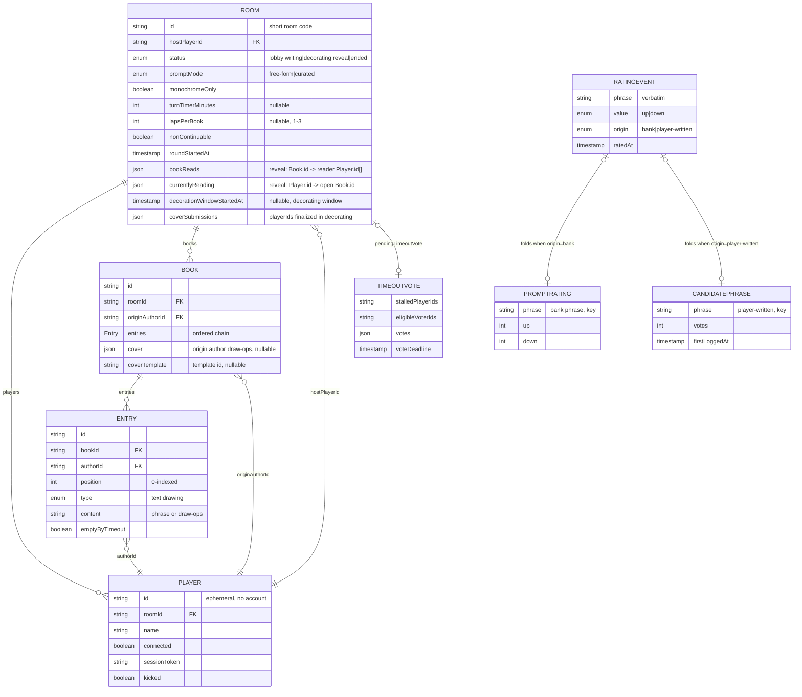
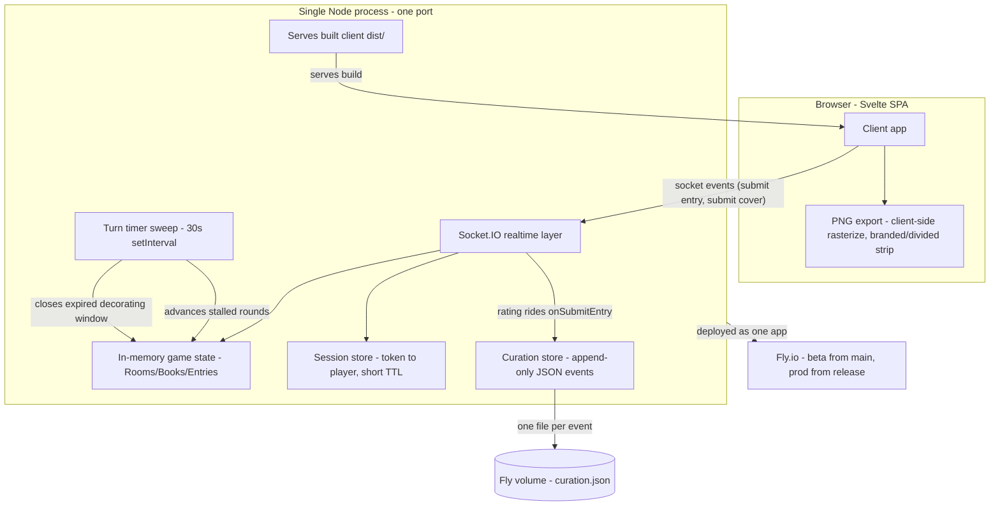
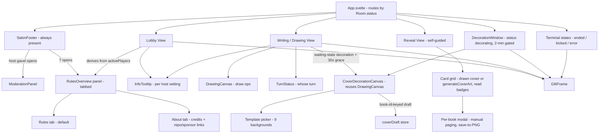

<p align="center">
  <a href="https://svelte.dev"></a>
  <a href="https://socket.io"></a>
  <a href="https://github.com/moui72/exquisite-telephone/actions/workflows/ci.yml"></a>
  <!-- ardd-badge-version-start -->
  <a href="https://github.com/moui72/artifact-driven-dev"></a>
  <!-- ardd-badge-version-end -->
  <a href="https://github.com/sponsors/moui72"></a>
</p>

# Exquisite Telephone

A browser-based multiplayer party game in the spirit of Telestrations and
skribbl.io: players alternate **writing a phrase** and **drawing it**, each
"book" passes around the circle, and at the end everyone sees how a phrase
drifted through the chain of translation. Sessions are small private groups
joining by a room code — no accounts, no persistent identity beyond a
session.

Play it now:

- **Production** — <https://ex-tel.ty-pe.com>
- **Beta** (latest `main`) — <https://beta-ex-tel.ty-pe.com>

## Tech stack

A pnpm workspace of three packages — `shared` (types/logic), `server`
(Node + Socket.IO), and `client` (Svelte + Vite). One Node process hosts the
realtime layer and, in production, serves the built client itself. Game state
lives in server memory; there is no database. See the architecture diagrams
below (generated from the design docs in `.project/artifacts/`).

## Running locally

**Prerequisites:** Node 22 (see `.nvmrc`) and [pnpm](https://pnpm.io).

```bash
pnpm install
```

The server and client run as two dev processes. In separate terminals:

```bash
pnpm dev:server   # game server on http://localhost:3000
pnpm dev:client   # Vite dev server on http://localhost:5173
```

Then open **<http://localhost:5173>**. The client connects to the socket
server same-origin (`io()`); in dev, Vite proxies `/socket.io` traffic to the
server on port 3000, so no extra configuration is needed. Open a second
browser (or an incognito window) to join the same room code as another
player.

To run the production shape locally — one process serving the built client:

```bash
pnpm build
pnpm --filter server start   # serves the built client on PORT (default 3000)
```

## Checks

```bash
pnpm lint         # eslint
pnpm typecheck    # shared build + tsc across all packages
pnpm test         # full workspace test suite
```

A Husky pre-commit hook runs all three, in that order, before a commit is
accepted. The same lint / type-check / test suite runs in CI on every push
and pull request, and **CI is the gate of record** — the hook is a local
convenience that catches the same issues earlier.

## Deployment

The app deploys to [Fly.io](https://fly.io) as **two separate apps**, one per
channel:

|              | Production                 | Beta                            |
| ------------ | -------------------------- | ------------------------------- |
| URL          | <https://ex-tel.ty-pe.com> | <https://beta-ex-tel.ty-pe.com> |
| Fly app      | `exquisite-telephone`      | `exquisite-telephone-beta`      |
| Config       | `fly.toml`                 | `fly.staging.toml`              |
| Deploys from | `release` branch           | `main` branch                   |
| Trigger      | manual workflow dispatch   | automatic on every push         |

- **Beta deploys automatically:** every push to `main` deploys beta within
  minutes (`.github/workflows/ci.yml`), so anything merged is live on beta
  right away.
- **Production is an explicit human act:** it deploys only via the
  `promote.yml` workflow (manual dispatch), which fast-forwards `release`
  from `main` and then runs `flyctl deploy` against `fly.toml`. `release` only
  ever receives a fast-forward of `main` and is never developed on directly.

The two Fly configs are meant to differ in exactly one key (`app`), so they
are **generated from a single template** rather than hand-maintained — run
`pnpm gen:fly` to regenerate and `pnpm check:fly` to verify; CI fails if the
committed files drift from the generated output.

## Contributing

Issues and pull requests are welcome.

- **Commit messages** follow [Conventional Commits](https://www.conventionalcommits.org)
  (`feat`, `fix`, `refactor`, `docs`, …) — see `CLAUDE.md` for the scopes used
  here.
- **Tests come first:** every behavior change is expected to be accompanied by
  a test (the project follows a test-first paradigm). Make sure `pnpm lint`,
  `pnpm typecheck`, and `pnpm test` all pass before opening a PR — CI will run
  them.
- **Design decisions** live in `.project/artifacts/` and are managed with the
  [Artifact-Driven Development](https://github.com/moui72/artifact-driven-dev)
  (ArDD) workflow; `.project/README.md` is a guide to reading those files. If
  a change alters product behavior or architecture, update the relevant
  artifact alongside the code.
- **Contribution licensing:** because the project is dual-licensed
  (noncommercial for everyone, commercial by separate arrangement — see
  [License](#license)), contributions must come in under terms that let the
  maintainer relicense them commercially. By opening a pull request you agree
  your contribution may be offered under both the noncommercial license and
  any commercial license the maintainer grants.

If you enjoy the game, you can support development via
[GitHub Sponsors](https://github.com/sponsors/moui72).

## License

This project is **source-available, not open source**. It is licensed under
the [PolyForm Noncommercial License 1.0.0](./LICENSE.md): you may use, fork,
modify, and share it freely for any **noncommercial** purpose. **Commercial
use requires a separate license** from the copyright holder — open an issue
or reach out via [github.com/moui72](https://github.com/moui72) to arrange
one. See [`LICENSE.md`](./LICENSE.md) for the full terms.

## Datamodel



## Infrastructure



## UI



