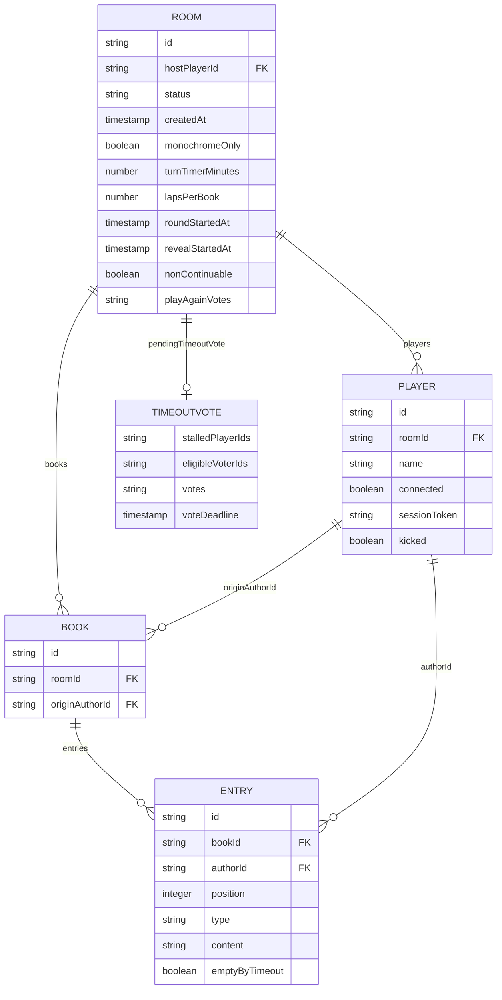
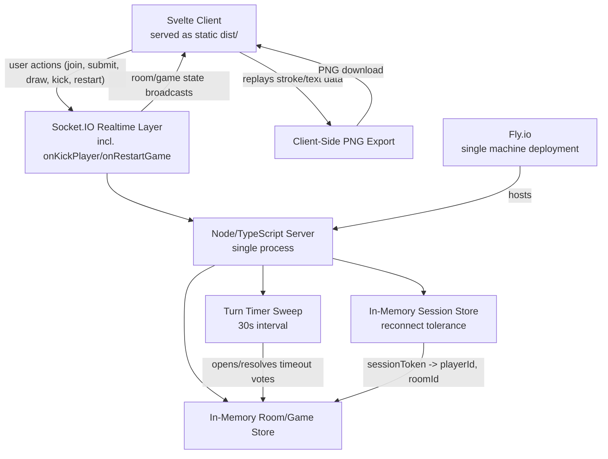
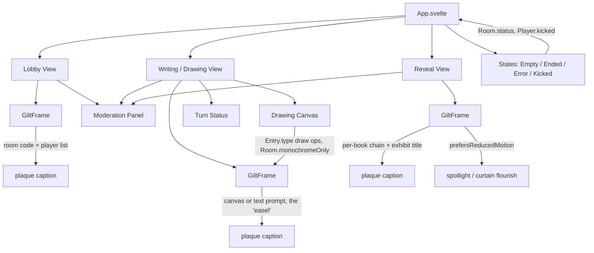

 

## Datamodel

```mermaid
erDiagram
    ROOM ||--o{ PLAYER : "players"
    ROOM ||--o{ BOOK : "books"
    ROOM ||--o| TIMEOUTVOTE : "pendingTimeoutVote"
    PLAYER ||--o{ BOOK : "originAuthorId"
    BOOK ||--o{ ENTRY : "entries"
    PLAYER ||--o{ ENTRY : "authorId"

    ROOM {
        string id
        string hostPlayerId FK
        string status
        timestamp createdAt
        boolean monochromeOnly
        number turnTimerMinutes
        number lapsPerBook
        timestamp roundStartedAt
        timestamp revealStartedAt
        boolean nonContinuable
        string playAgainVotes
    }
    PLAYER {
        string id
        string roomId FK
        string name
        boolean connected
        string sessionToken
        boolean kicked
    }
    BOOK {
        string id
        string roomId FK
        string originAuthorId FK
    }
    ENTRY {
        string id
        string bookId FK
        string authorId FK
        integer position
        string type
        string content
        boolean emptyByTimeout
    }
    TIMEOUTVOTE {
        string stalledPlayerIds
        string eligibleVoterIds
        string votes
        timestamp voteDeadline
    }
```

## Infrastructure

```mermaid
graph TD
    Client[Svelte Client<br/>served as static dist/]
    Server[Node/TypeScript Server<br/>single process]
    SocketIO[Socket.IO Realtime Layer<br/>incl. onKickPlayer/onRestartGame]
    RoomStore[In-Memory Room/Game Store]
    SessionStore[In-Memory Session Store<br/>reconnect tolerance]
    TimerSweep[Turn Timer Sweep<br/>30s interval]
    ExportPipeline[Client-Side PNG Export]
    Fly[Fly.io<br/>single machine deployment]

    Client -- "user actions (join, submit, draw, kick, restart)" --> SocketIO
    SocketIO -- "room/game state broadcasts" --> Client
    SocketIO --> Server
    Server --> RoomStore
    Server --> SessionStore
    Server --> TimerSweep
    TimerSweep -- "opens/resolves timeout votes" --> RoomStore
    SessionStore -- "sessionToken -> playerId, roomId" --> RoomStore
    Client -- "replays stroke/text data" --> ExportPipeline
    ExportPipeline -- "PNG download" --> Client
    Fly -- "hosts" --> Server
```

## UI

```mermaid
graph TD
  App[App.svelte]

  App --> Lobby[Lobby View]
  App --> WD["Writing / Drawing View"]
  App --> Reveal[Reveal View]
  App --> States["States: Empty / Ended / Error / Kicked"]

  Lobby --> LobbyFrame[GiltFrame] -->|room code + player list| LobbyPlaque[plaque caption]
  Lobby --> Mod[Moderation Panel]

  WD --> WDFrame[GiltFrame] -->|canvas or text prompt, the 'easel'| WDPlaque[plaque caption]
  WD --> Canvas[Drawing Canvas]
  WD --> Turn[Turn Status]
  Canvas -->|Entry.type draw ops, Room.monochromeOnly| WDFrame
  WD --> Mod

  Reveal --> RevealFrame[GiltFrame] -->|per-book chain + exhibit title| RevealPlaque[plaque caption]
  RevealFrame -->|prefersReducedMotion| Spotlight[spotlight / curtain flourish]
  Reveal --> Mod

  States -->|Room.status, Player.kicked| App
```

